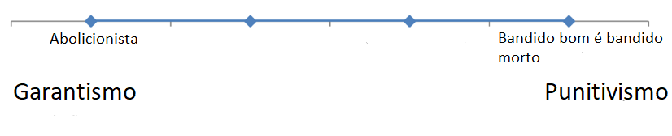
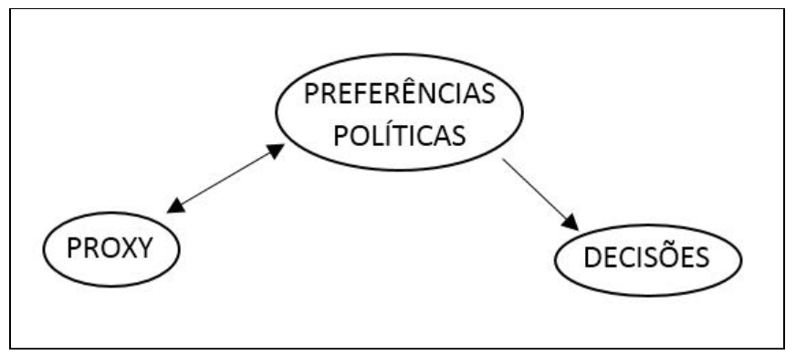

```{r include=FALSE}
library(kableExtra)
```

# Introdução

## Objetivo

&nbsp;
&nbsp;

* Explicar porque os juízes decidem da forma como decidem.

&nbsp;
&nbsp;

* Mais especificamente, explicar porque os juízes decidem de forma diversa casos semelhantes.

## Duas situações, quatro decisões

&nbsp;
&nbsp;

```{r echo=FALSE}
a <- data.frame("Caso" = c("Acusado de tráfico. Segundo policiais, o acusado jogou uma sacola no chão contendo drogas às 18hrs. O réu negou e apresentou provas de que havia trabalhado como ajudante de pedreiro até às 17hrs.", "Acusada de tráfico. Segundo policiais, a ré jogou um embrulho no chão contendo drogas. A ré negou e disse que estava apenas no lugar 'errado, na hora errada'.", "Acusado de furto. Furtou cinco cuecas no valor de R$ 41,95.", "Acusado de furto. Furtou uma furadeira elétrica no valor de R$ 252,90"), "Decisão" = c("Condenação", "Absolvição", "Condenação", "Absolvição"))

kable(a) %>%
  kable_styling("striped", full_width = F) %>%
  pack_rows("Situação 1", 1, 2) %>%
  pack_rows("Situação 2", 3, 4)

```


## Justificativa em três níveis

&nbsp;
&nbsp;

* Por que estudar o comportamento de juízes?

&nbsp;
&nbsp;

* Por que estudar Juízes de 1º Grau?

&nbsp;
&nbsp;

* Por que estudar sentenças criminais?

# Explicando o comportamento judicial

## Teorias

&nbsp;
&nbsp;

* Teoria Legal?

&nbsp;
&nbsp;

* Teoria Atitudinal

&nbsp;
&nbsp;

* Teoria Estratégica

## O que são preferências políticas

&nbsp;
&nbsp;

<center>  </center>

## Dimensão da política criminal: garantismo-punitivismo

&nbsp;
&nbsp;

<center>  </center>

## Teoria Atitudinal

&nbsp;
&nbsp;

<center>  </center>

## Teoria Estratégica

&nbsp;
&nbsp;

* **Objetivos**

&nbsp;
&nbsp;

* **Antecipação**

&nbsp;
&nbsp;

* **Contexto institucional**

## Teoria Estratégica

&nbsp;
&nbsp;

<center>  </center>

## Explicações distintas, predições iguais

&nbsp;
&nbsp;

```{r echo=FALSE}
a <- data.frame("Teorias" = c("Atitudinal", "Atitudinal", "Estratégica", "Estratégica"), "Incentivos relevantes" = c("Sim", "Não", "Sim", "Não"),
                "Comportamento Predito" = c("Sincero", "Sincero", "Sofisticado", "Sincero"), "Explicação" = c("Ativação das preferências políticas","Ativação das preferências políticas", "Maximização dos objetivos", "Ausência de incentivos relevantes"))

kable(a) %>%
  kable_styling("striped", full_width = F) %>%
  collapse_rows(columns = 1, valign = "top")%>%
  row_spec(c(2,4), bold = T, color = "white", background = "#D7261E")

```

## Explicando o comportamento dos juízes do TJSP

&nbsp;
&nbsp;

* Julgamento Individual (Contexto colegiado)
* Decisão não passível de revisão pelos demais Poderes (Contexto da separação entre os poderes)
* Distribuição aleatória dos recursos (Contexto hierárquico)
* Falta de homogeneidade nos Tribunais (Contexto Hierárquico)
* Alta taxa de reversão não impede promoção na carreira (Contexto hierárquico) 


## Modelo e hipótese

&nbsp;
&nbsp;

<center> $$\underbrace{d_{ic}}_\text{Decisão do juiz i no caso c} = \alpha + \underbrace{\beta_1I_i}_\text{Ideologia do juiz i} + \underbrace{\epsilon}_\text{Erro normalmente distribuído}$$ </center>

&nbsp;
&nbsp;

**Hipótese**: juízes punitivistas possuem uma maior probabilidade de proferirem uma sentença condenatória do que juízes garantistas. 


# Mensurando as preferências políticas


## Duas estratégias

&nbsp;
&nbsp;

A preferência política é uma variável latente, isto é, não é passível de ser mensurada diretamente, diferente da altura, sexo ou peso, por exemplo. Em razão disso, para medi-la necessitamos de alternativas indiretas como:

&nbsp;
&nbsp;

* Proxy

&nbsp;
&nbsp;

* Comportamento observado

## Proxy

&nbsp;
&nbsp;

<center>  </center>

## Comportamento observado

&nbsp;
&nbsp;

<center>  </center>

## Estratégia adotada - proporção de sentenças condenatórias

&nbsp;
&nbsp;

Se a preferência política afeta a decisão judicial, como predizem as teorias, a proporção de sentenças condenatórias de um juiz em um determinado crime é um bom indicador de seu ponto ideal na dimensão *garantismo-punitivismo*.

&nbsp;
&nbsp;

Considerando que os processos são distribuídos aleatoriamente, se dois juízes A e B possuem as proporções de condenação no crime de furto de, respectivamente, 40% e 80%, podemos dizer que o primeiro é mais garantista do que o segundo. 

<p style="border:3px; border-style:dashed; border-color:#FF4136; padding: 1em;font-size:30px;">
Naturalmente, quanto maior a amostra, maior a precisão da estimativa do ponto ideal, haja vista que menor será a probabilidade de que particularidades do caso concreto afetem a proporção. </p>

## Estratégia adotada - proporção + distância euclidiana

&nbsp;
&nbsp;

Pela proporção do crime de furto, sabemos que o juiz A é mais garantista do que o B. Se descobrimos que a proporção de sentenças condenatórias em outro crime (tráfico) é de 90% (A) e 10% (B), podemos afirmar com segurança que o juiz A é ainda mais garantista em relação ao B do que havíamos previsto ao analisar apenas o crime de furto.

&nbsp;
&nbsp;

Saber as proporções de decisões condenatórias dos juízes em vários crimes nos permite estimar os seus pontos ideais com ainda maior precisão.

&nbsp;
&nbsp;

Podemos calcular os pontos ideais dos juízes a partir das proporções de condenações em uma série de crimes usando a fórmula da distância euclidiana:

&nbsp;
&nbsp;

$$d(a,b)=\sqrt{\sum_{i=1}^{n}(a_i - b_i)^2} $$

## Estratégia adotada

&nbsp;
&nbsp;

O cálculo das as distâncias euclidianas entre os juízes retorna uma matriz de distância. 


&nbsp;
&nbsp;

Como o nosso objetivo é obter um vetor (que será a variável preferência política) e não uma matriz, iremos selecionar o juiz mais garantista como sendo a referência (ou o âncora) e calcularemos todas as distâncias a partir dele.

## Estratégia adotada - exemplo

&nbsp;
&nbsp;

```{r, include=FALSE}
library(tidyverse)
```

```{r, fig.align='center'}
juizes <- data.frame("Furto" = c(30, 40, 60, 80), "Tráfico" = c(60, 72, 70, 90),
                     nome=c("Juiz 1", "Juiz 2", "Juiz 3", "Juiz 4"))

ggplot(juizes, aes(x=Furto, y=Tráfico))+
  geom_text(aes(label=nome))+
  coord_cartesian(xlim = c(0,100), ylim=c(0,100))+
  theme_classic()
```


## Estratégia adotada - exemplo

&nbsp;
&nbsp;

```{r, echo=TRUE}
a <- dist(juizes[,1:2], method="euclidean")
as.matrix(a)
```

&nbsp;
&nbsp;

Neste exemplo, o Juiz 1 seria o âncora. Logo, os pontos ideais dos juízes 1, 2 3 e 4 seriam, respectivamente: 0, 15, 31 e 58.


## Estratégia adotada - circularidade

&nbsp;
&nbsp;

Para evitar o problema da circularidade, os crimes a partir dos quais foi medida a preferência política não compõem a base de dados que será utilizada para testar o efeito da ideologia sobre as decisões.

&nbsp;
&nbsp;

Juridicamente, é perfeitamente possível que um juiz tenha uma alta proporção de condenação no crime de furto e uma pequena proporção no crime de tráfico. As questões jurídicas e probatórias que envolvem esses crimes são totalmente distintas.

&nbsp;
&nbsp;

Em outras palavras, legalmente falando, saber a proporção de condenações de um Juiz em um determinado crime não deveria nos permitir estimar a sua proporção de condenação em outros crimes.

# Testando a hipótese

## Construindo a base de dados - *web scraping*

&nbsp;
&nbsp;

<video width="320" height="240" controls>
  <source src="webscraping.mp4" type="video/mp4">
</video>

## Construindo a base de dados - codificação das decisões

&nbsp;
&nbsp;

```{r, include=FALSE}
library(rebus)
```

```{r}
condena <-  or("julg" %R% or("o", "a-se") %R% one_or_more(SPC) %R%
                    optional(or("a denúncia", "a presente ação") %R% one_or_more(SPC))%R%
                    "procedente", "julg" %R% or("o", "a-se") %R% one_or_more(SPC) %R%
                    or("parcialmente", "em parte") %R% one_or_more(SPC) %R%
                    "procedente", "fix" %R% one_or_more(WRD) %R%
                    one_or_more(SPC) %R% "a" %R% "condena" %R% or("ção", "çao", "cão", "cao"),
                  "crime" %R% optional("s") %R% one_or_more(SPC) %R%
                    "rest" %R% or("ou", "aram") %R% one_or_more(SPC) %R% "configurado",
                  "fix" %R% or("a-se","am-se", "o", "ando", "o-lhe", "ar") %R% one_or_more(SPC) 
                  %R% optional(or("as", "a")) %R%
                    one_or_more(SPC) %R% "pena",
                  "condeno" %R% one_or_more(SPC),
                  "arbitro" %R% one_or_more(SPC) %R% or("a", "as") %R%
                    one_or_more(SPC) %R% "pena", or("passo", "passa-se") %R% 
                    or(", pois, ", one_or_more(SPC))  %R%
                    or("à", "a") %R% one_or_more(SPC) %R% or("dosimetria", "dosa"))
```


## Resultados

&nbsp;
&nbsp;

O método proposto no capítulo anterior se baseia em dois parâmetros: 1) quantos (e quais) crimes serão utilizados para medir as preferências; 2) número mínimo de decisões proferidas por cada juiz em cada crime.
Quanto maior forem ambos os parâmetros, mais preciso será o método

&nbsp;
&nbsp;

No entanto, os Juízes de 1º Grau, como já dito, nem sempre julgam todos os tipos de crime, de modo que aumentar a quantidade de crimes utilizados para medir as preferências, reduz a amostra de Juízes. O mesmo ocorre se aumentarmos o número mínimo de decisões por Juiz em cada crime. Às vezes, um Juiz até chega a proferir decisões em vários crimes, mas nem sempre em grande quantidade.

&nbsp;
&nbsp;

Ou seja, o método desenvolvido apresenta um trade-off entre precisão e tamanho da amostra. Quanto mais preciso (maior o número de crimes e do número mínimo de decisões proferidas por cada Juiz em cada crime), menor será a amostra disponível de Juízes, prejudicando o teste da hipótese.


## Resultados

&nbsp;
&nbsp;

A estratégia adotada foi a de testar a hipótese a partir de algumas combinações dos parâmetros, sempre mantendo uma amostra final superior a 30 Juízes, quais sejam: 1) Furto e Roubo com, no mínimo, 100 decisões por crime; 2) Furto, Roubo e Receptação com, no mínimo, 50 decisões por crime; 3) Furto, Roubo, Receptação e Tráfico com, no mínimo, 30 decisões por crime.

&nbsp;
&nbsp;

Outras combinações podem ser testadas através do [Dashboard](https://lucasufmg.shinyapps.io/shiny/) ou fazendo o download da base de dados e dos códigos no endereço: https://dataverse.harvard.edu/dataset.xhtml?persistentId=doi:10.7910/DVN/TCYTEO


## Resultados - 1ª Combinação

```{r, include=FALSE}

library(data.table)
library(tidyverse)
library(gdata)
library(reshape2)

base <- rio::import("base_codificada.rda")
sp_idhm <- rio::import("sp_idhm.xlsx") #Parte da base do Atlas de Desenvolvimento Humano
base_homicidio <- rio::import("base_homicidio.xlsx") #Parte dos dados do Atlas da Violencia (IPEA, 2019)

#######################
#  Preparando a base  #
#######################

#Transpor os dados de tx de homicidio e idhm
base$Comarca <- base$Comarca %>% str_to_upper() #Transformar em Caixa Alta

base[base$Comarca=="JUNDIAÍ / SP",]$Comarca <- "JUNDIAÍ" #Corrigir um nome

base[base$Comarca=="IPAUÇU",]$Comarca <- "IPAUSSU" #Corrigir um nome

base$idhm <- sp_idhm$IDHM[match(base$Comarca, sp_idhm$Município)] #Transpor os dados do IDHM para a base codificada

base_homicidio$mun <- base_homicidio$mun %>% str_to_upper() #Transformar em caixa alta

base$homicidio <- base_homicidio$tax_hom[match(base$Comarca,
                                               base_homicidio$mun)] #Transpor os dados da tx de homicidio para a base codificada


#########################
#  Testando a hipotese  #
#########################

#### Parametros

crimes <- list(c("furto", "roubo"), c("furto", "roubo", "receptação"),
               c("furto", "roubo", "tráfico", "receptação")) #1º parametro: crimes usados para medir a preferencia

n_decisoes <- c(100, 50, 30) #2º parametro: nº minimo de decisoes por juiz em cada crime

###Loop para os tres modelos

tabelas <- list() #objeto para armazenar os resultados dos modelos
n_juizes <- data.frame() #objeto para armazenar o tamanho da amostra de juizes por modelo
decisoes <- data.frame() #objeto para armazenar o nº de decisoes da base de teste


for(i in 1:3){

  ###Calcular as proporcoes de condenacoes dos juizes nos crimes
  base_teste <- base %>% 
    group_by(Magistrado, Assunto)%>% #Agrupa pelo nome do magistrado e pelo crime
    summarise("prop_condena" = (sum(condena)/ #calcula a proporcao de condenacao e o total julgados por juiz/ano
                                  (sum(condena)+ sum(absolve)))*100,
              "Total" = sum(condena) +
                sum(absolve)) %>%
    filter(Assunto %in% crimes[[i]] & Total >= n_decisoes[i]) %>%  #Parametros do teste: Seleciona os crimes e o minimo de decisoes por crime
    select(-Total) %>% 
    spread(Assunto, "prop_condena") %>% 
    drop_na()
  
  n_juizes <- rbind(n_juizes, nrow(base_teste)) #Total de juizes na amostra
  
  ###Calcular as distancias ideologica entre os juizes
  a <- (base_teste[,2]+base_teste[,3])/2
  
  base_teste$media <- a[,1]
  
  base_teste <- base_teste %>%
    arrange(media) %>% 
    ungroup() %>% 
    mutate(num = 1:n()) 
  
  
  dist_mag <- base_teste %>% select(crimes[[i]]) %>% 
    dist(method="euclidian") #Calcular a distância entre os juizes
  
  dist_mag <- melt(as.matrix(dist_mag), varnames = c("row", "col")) %>%
    arrange(desc(value)) #Transforma a base
  
  if (dist_mag[1,1] > dist_mag[1,2]){
    dist_mag <- dist_mag %>% filter(row==dist_mag[1,2])
  } else {
    dist_mag <- dist_mag %>% filter(row==dist_mag[1,1])
  }  #COnsiderando o juiz com a menor media como ancora, logo, como 0
  
  #Transpondo a medida para os juizes
  
  base_teste$preferencia <- dist_mag$value[match(base_teste$num,
                                                 dist_mag$col)] 
  
  #########################
  #  Testando a hipotese  #
  #########################
  
  #Tranpor a medida de preferencia para a base
  base$preferencia <- base_teste$preferencia[match(base$Magistrado,
                                                   base_teste$Magistrado)] 
  
  #Finalizar a base
  base_teste <- base %>% drop_na(preferencia) %>%  #Retirar juizes fora da amostra
                  filter(!Assunto %in% crimes[[i]]) #Retirar os crimes usados para a construcao da medida
  
  decisoes <- rbind(decisoes, nrow(base_teste)) #Total de decisoes na base de teste
  
  base_teste$entrancia <- as.factor(base_teste$entrancia) #transforma a variavel entrancia em fator
  
  base_teste$entrancia <- relevel(base_teste$entrancia, ref="final")
  
  #####Rodando o modelo
  
  reg <- glm(condena ~ preferencia + idhm + homicidio  + preferencia*entrancia +
               as.factor(Assunto), data=base_teste, family="binomial")
  
  a <- summary(reg)
  
  a <- round(a$coefficients, 3)
  
  a <- a[c(1:6, (nrow(a)-1),nrow(a)),]
  
  
  b <- round(exp(reg$coefficients), 3)
  
  b <- b[c(1:6, (length(b)-1),length(b))]
  
  d <- as.data.frame(round(exp(confint.default(reg)), 3))
  
  d <- paste(d$`2.5 %`, ",", d$`97.5 %`)
  
  d <- d[c(1:6, (length(d)-1),length(d))]
  
  a <- as.data.frame(cbind(a, b, d))
  
  a <- a %>% select(-`z value`) %>% 
    rename("Razão de chances" = b, "Intervalo" = d) %>% 
    select(1,2,4,5,3)
  
  rownames(a) <-  c("Intercepto", "Preferência", "IDHM",
                    "Taxa de Homicídio",
                    "Entrância inicial -Ref: Entrância Final",
                    "Entrância intermediária -Ref: Entrância Final",
                    "Preferência: Entrância Inicial",
                    "Preferência: Entrância Intermediária")
  
  tabelas[[i]] <- a
}
```


&nbsp;
&nbsp;


```{r, echo=F}
kable(tabelas[[1]]) %>% 
  kable_styling("striped", full_width = T)
```


## Resultados - 2ª Combinação

&nbsp;
&nbsp;

```{r, echo=F}
kable(tabelas[[2]]) %>% 
  kable_styling("striped", full_width = T)
```

## Resultados - 3ª Combinação

&nbsp;
&nbsp;

```{r, echo=F}
kable(tabelas[[3]]) %>% 
  kable_styling("striped", full_width =T)
```


## Resultados - Interpretação

&nbsp;
&nbsp;

A razão de chances da preferência política ficou nos três modelos entre 1.023 a 1.042. Isso significa que a cada aumento de uma unidade no ponto ideal (em direção a uma ideologia mais punitivista) há um aumento entre 2.3% a 4.2% de chance de o juiz proferir uma sentença condenatória, ao invés de uma absolutória.

&nbsp;
&nbsp;

Exemplificando, os Juízes que se situaram nos extremos ideológicos do último modelo (3ª Combinação) estavam a uma distância entre si de 71 unidades. A partir da razão de chances, podemos dizer que o Juiz mais punitivista tinha aproximadamente entre 2,63 a 4 vezes mais chances de proferir uma sentença condenatória do que o Juiz mais garantista da amostra.

## Discussão

&nbsp;
&nbsp;

**Sentencing**: Características dos juízes também importam

&nbsp;
&nbsp;

**Comportamento Judicial**: Postulado da hierarquia?

# Considerações finais

## Conclusão

&nbsp;
&nbsp;

Em termos simples, os achados empíricos desta dissertação indicam que juízes que possuem uma preferência política a favor de um recrudescimento das punições distribuídas pelo governo, aumento de penas e encarceramentos tenderão, mesmo diante das mesmas evidências, provas, leis, princípios e jurisprudências, a proferir sentenças condenatórias com maior frequência do que aqueles juízes que possuem preferências políticas opostas.

&nbsp;
&nbsp;

Exemplo: casos narrados na introdução sobre Furto


## Pesquisas Futuras

&nbsp;
&nbsp;

1 -  Mensuração das preferências políticas em uma dimensão fundamental (liberal-conservador)

&nbsp;
&nbsp;

2 - Construção de um desenho de pesquisa capaz de testar qual das duas teorias (Atitudinal e Estratégica) possui um maior poder explicativo

&nbsp;
&nbsp;

3 - Estimação do efeito das preferências políticas sobre o tamanho das penas

&nbsp;
&nbsp;

4 - Identificação dos vieses e heurísticas que afetam os Juízes de 1º Grau

&nbsp;
&nbsp;

5 - Mensuração das preferências de todos os juízes em uma escala comparável


